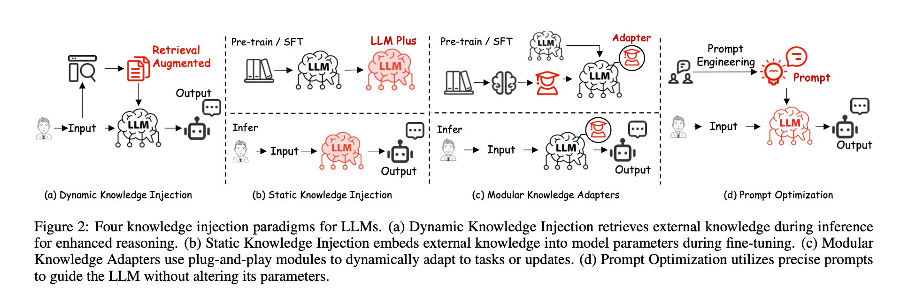

# 0. Introduction

With the progress of AI large model towards Artificial General Intelligence (AGI), 
there are more and more research and pracitise on Artificial Domain Intelligence (ADI), aka domain specific LLM, and domain knowledge injection for LLM. 

["Injecting Domain-Specific Knowledge into Large Language Models: A Comprehensive Survey"](https://arxiv.org/abs/2502.10708), 
summarizes the implementations of domain specific LLM into 4 paradigms, illustrated as the following diagram. 

The boundaries of the 4 paradigms are not fixed. In practise, it is more likely to integrate multiple techniques, rather than use only one single technique. 

1. For the private data and the recently updated data, "dynamic knowledge injection", especially [Retrieval-Augmented Generation (RAG)](https://arxiv.org/abs/2005.11401)
   is very useful.

2. For static domain knowledge, Supervised Fine Tuning (SFT) with [Low Rank Adaptation (LoRA)](https://arxiv.org/abs/2106.09685) is very popular,
   to improve the quality of the answer, and to reduce the response time.

3. To reduce the computational cost of SFT, many techniques are used in addition to LoRA, including but not limited to,
   
   * modular adapter, e.g. [llama adapter](https://arxiv.org/abs/2303.16199),
     
     The adapters are plugins to the LLM with domain knowledge.
     And the SFT training only occurs to those adapters, rather than the LLM.
     
   * mixture of experts, e.g. [mistral](https://arxiv.org/abs/2401.04088),
  
     MoE aims at reducing the training cost of the feed-forward modules inside the transformers,
     by leveraging the sparseness of the matrics of feed-forward module's MLP weights. 
  
   * GPU IO-awareness, e.g. [flash attention](https://arxiv.org/abs/2205.14135)
  
     Flash attention directly uses Nvidia's low level C/C++ APIs, so as to optimize the IO efficiency between the GPU SRAM and HBM.

     Flash attention applies this approach to enhance the training efficiency of the attention modules inside the transformers.
     But in addition to the attention modules, the same approach can also applied to other modules of the transformers. 
  
4. In order to mimick human expert's reasoning, reinforcement learning can be applied the trained LLM after SFT. 

   * Deepseek's [GRPO](https://arxiv.org/abs/2402.03300) is a variant of PPO algorithm,
     it supports both Output Reward Model (ORM) and Process Reward Model (PRM).

     When training the LLM, the Output Reward Model (ORM) only evaluates the final answers of the LLM,
     ignoring the intermediate steps.

     The Process Reward Model (PRM) not only evaluates the final answers, but also evaluate the intermediate steps.
     Therefore, PRM greatly improves the LLM's reasoning capacity.
     
   * The application scenario of GRPO is a single pair of question and answer.
     For multi-turn long-horizon conversation，it is worthy to study the approach of [ArCHer](https://arxiv.org/abs/2402.19446). 

     ArCHer is a [Advantage Actor Critic (A2C)](https://arxiv.org/abs/1602.01783) deep reinforcement learning framework
     with a hierarchical structure.
     A high-level off-policy value-based RL algorithm aggregates reward over utterances,
     and a low-level RL algorithm utilizes this high-level value function
     to train a token policy within each utterance or turn.

5. To mimick the preference of the domain experts, like their wording habits and formats in writing,
   [DPO](https://arxiv.org/abs/2305.18290) and [KTO](https://arxiv.org/abs/2402.01306)
   can also be applied in the post-training.

The 4 paradigms of domain specific LLM focuses on the large *language* model. 
A full-fledged domain specific AI model will also include additional components, including but not limited to, 

1. Multi-modality,
  
   Audio, image and video comprehension and generation.

2. Tools to use,

   Integrate AI models with computer softwares, like browsers and other APPs.

   Empower AI models to control robots or other devices.

   
