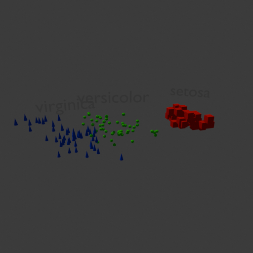

# Chapter 01 - 02. Blender Python Scripting 

## 1. Objectives

As mentioned in [the previous article](./volume_02.%203D/chapter_01.01_infinigen_guide.md), 
[Infinigen](https://github.com/princeton-vl/infinigen) is a python library
that utilizes the [Blender python api](https://docs.blender.org/api/current/info_quickstart.html)
to generate synthetic images of nature scene, as well as indoors layouts with furnitures. 

This article is an essential developer's guide to write python scripts with Blender Python (BPY). 

Some references, 

1. [Blender official python api](https://docs.blender.org/api/current/info_quickstart.html)
   
2. [Blender 3D: Noob to Pro](https://en.wikibooks.org/wiki/Blender_3D:_Noob_to_Pro#Table_of_Contents)

   This is a wikibook mainly written by Blender team members. Its content focuses on the concepts of 3D modeling and rendering,
   and the usage of Blender UI widgets.
   
   Only the first chapter [Python Scripting](https://en.wikibooks.org/wiki/Blender_3D:_Noob_to_Pro/Advanced_Tutorials/Python_Scripting/Introduction)
   of Unit 4 is related to the Blender Python (BPY). 

3. [Github: njanakiev/blender-scripting](https://github.com/njanakiev/blender-scripting)

   This is a quickstart to write python script to implement simple objects, like sphere and donus in Blender.

   However, if diving into its source codes, it also gives examples how to create more complex objects, with animation and video etc.

4. [Github: zeffii/BlenderPythonRecipes](https://github.com/zeffii/BlenderPythonRecipes/wiki)

   This github repo is more related with python geometry, rather than Blender.
   When you want to create some advanced features and need geometric python snippets, this may help. 

5. [Blender python blogs](https://blenderscripting.blogspot.com/)

   A blogspot contains some Blender script snippets.

&nbsp;
## 2. njanakiev/blender-scripting

### 2.1 fisher_iris_visualization mp4

To obtain practical experience of Blender python scripting quickly, 
we followed the instruction of [Github: njanakiev/blender-scripting](https://github.com/njanakiev/blender-scripting). 

1. We executed a script `run_script.py`, to generate a series of png images, 
`scripts/frames/fisher_iris_visualization%04d.png`, 

    ~~~
    robot@robot-test:~$ conda deactivate
    (infinigen) robot@robot-test:~$ git clone https://github.com/njanakiev/blender-scripting.git

    (infinigen) robot@robot-test:~$ cd blender-scripting/
    (infinigen) robot@robot-test:~/blender-scripting$ blender -b -P run_script.py
    ~~~

    Here is a sample of the series of images,

   

     
   

2. We used `ffmpeg` to convert the series of images into a mp4 video clip,
   [fisher_iris_20250503.mp4](./assets/0102_fisher_iris_20250503.mp4). 

   You need to download the video clip first, after then view it using any video displayer,
   like [VLC media player](https://www.videolan.org/), or Chrome browser. 

    ~~~
    (infinigen) robot@robot-test:~/blender-scripting$ ffmpeg -r 15 \
        -i scripts/frames/fisher_iris_visualization%04d.png \
        -c:v libx264 -c:a aac -ar 44100 -pix_fmt yuv420p \
        outputs/fisher_iris_visualization.mp4
    ...
    Input #0, image2, from 'scripts/frames/fisher_iris_visualization%04d.png':
      Duration: 00:00:02.00, start: 0.000000, bitrate: N/A
      Stream #0:0: Video: png, rgba(pc), 512x512 [SAR 2834:2834 DAR 1:1], 25 fps, 25 tbr, 25 tbn, 25 tbc
    ...
    Output #0, mp4, to 'fisher_iris_visualization.mp4':
    ~~~

### 2.2 
