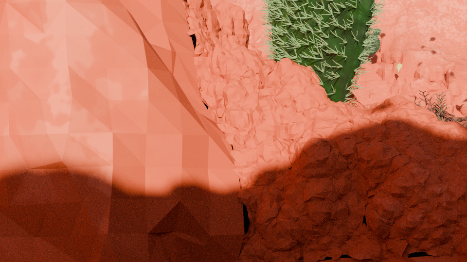
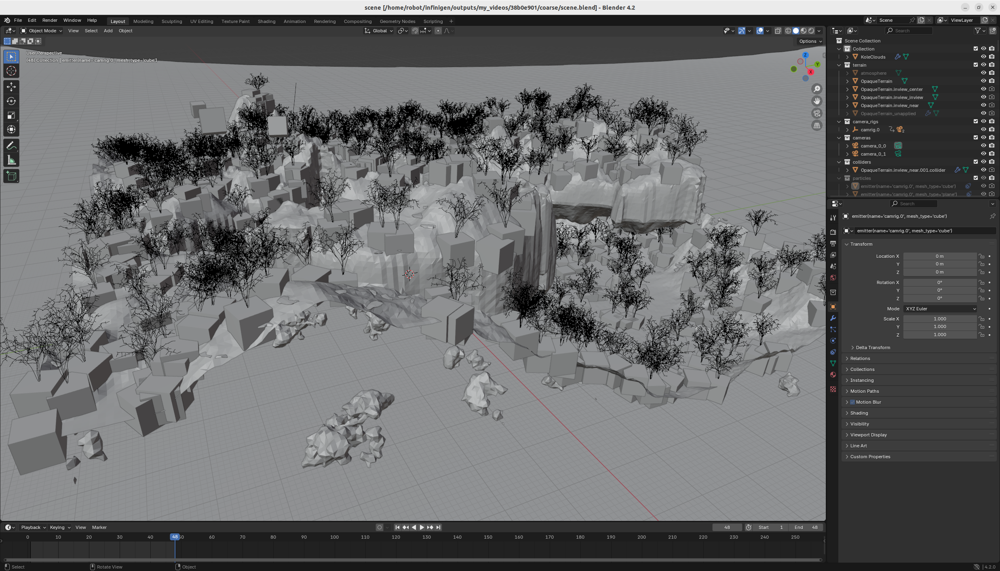

# Chapter 02 - 01. Infinigen Getting Started

## 1. Objectives

[Infinigen](https://github.com/princeton-vl/infinigen) is a python library
that utilizes the [Blender python api](https://docs.blender.org/api/current/info_quickstart.html)
to generate synthetic images of nature scene, as well as indoors layouts with furnitures. 

This article is a quickstart guide to use infinigen. 

&nbsp;
## 2. Installation

We installed infinigen in a Razor notebook `RZ09-0421`, empowered with nvidia `geforce RTX 3070Ti` GPU core. 

And our OS is `ubuntu 22.04`. 

Following [the infinigen's guide on installation](https://github.com/princeton-vl/infinigen/blob/main/docs/Installation.md#installing-infinigen-as-a-python-module), 
we installed `the infinigen as a python module` successfully. 

After then we added `infinigen as a blender python script` by executing `interactive_blender.sh`,

~~~
robot@robot-test:~/infinigen$ conda activate infinigen
(infinigen) robot@robot-test:~/infinigen$ pwd
/home/robot/infinigen

(infinigen) robot@robot-test:~/infinigen$ bash scripts/install/interactive_blender.sh
~~~

Hence, we run double modes of infinigen on the same notebook. 

&nbsp;
## 3. Test run

We generated a natural scene in two ways, both were succussful. 

1. The first one is [a step-by-step process](https://github.com/princeton-vl/infinigen/blob/main/docs/HelloWorld.md#generate-a-scene-step-by-step),
   the purpose is to test run `generate_nature.py`.

2. The second one is [one command execution](https://github.com/princeton-vl/infinigen/blob/main/docs/HelloWorld.md#generate-scenes-in-one-command),
   the purpose is to test run `manage_jobs.py`.

The result consists of many files, including many images. The human readable image is in the `outputs/hello_world/0/frames/Image/camera_0/` directory, 

   

     
   

Later on we will dive into the source codes of these two scripts, to study the usage of infinigen in depth. 

We also tried a more complex case, 

~~~
(infinigen) robot@robot-test:~/infinigen$ nohup python -m infinigen.datagen.manage_jobs \
  --output_folder outputs/my_videos --num_scenes 500 \
  --pipeline_config slurm monocular_video cuda_terrain opengl_gt \
  --cleanup big_files \
  --warmup_sec 60000 \
  --config trailer_video high_quality_terrain \
  -p fine_terrain.mesher_backend="OcMesher" \
  > log_20250502.txt &
~~~

It took about 30 minutes to finish. And according to the log, 
the generated content is a blender readable file `scene.blend`. 

~~~
(infinigen) robot@robot-test:~/infinigen$ tail -n 200 outputs/my_videos/38b0e901/logs/419177_0_log.err
...
[00:26:59.615] [logging] [INFO] | [Writing output blendfile]
[00:26:59.615] [execute_tasks] [INFO] | Writing output blendfile to /home/robot/infinigen/outputs/my_videos/38b0e901/coarse/scene.blend
[00:26:59.936] [logging] [INFO] | [Writing output blendfile] finished in 0:00:00.321006
[00:26:59.950] [logging] [INFO] | [MAIN TOTAL] finished in 0:36:49.082323
~~~

We opened the blender UI by executing the following, 

~~~
(infinigen) robot@robot-test:~/infinigen$ ./blender/blender
~~~

And then in the blender UI, we opened the file `scene.blend`, and saw the following 3D scene. 

   

     
   

